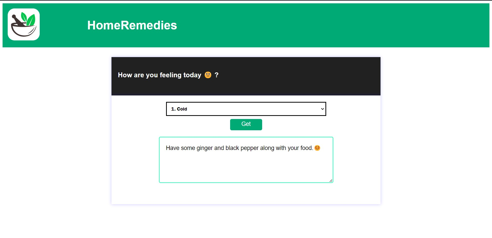
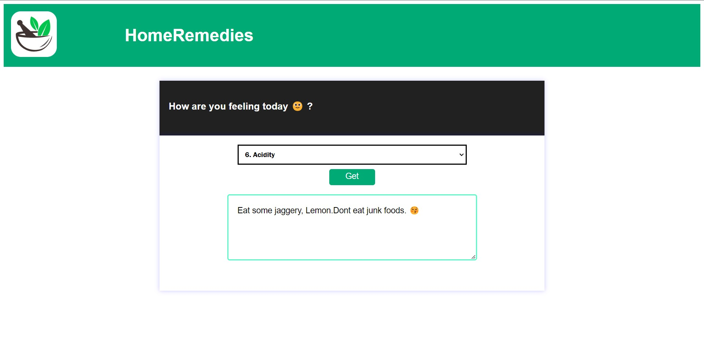

# Home Remedy

## About the Project

A home remedies application is a web application that provides information and instructions on natural remedies that can be used to treat common ailments and health issues. These remedies are often made with everyday ingredients found in the home, such as herbs, spices, fruits, and vegetables and some basic exercises.

## Importance
How can this application is help to **Seniors citizen**

1. **Health Concerns**: As people age, they tend to develop more health concerns. A home remedies application can help seniors to find natural remedies for common ailments such as colds, headaches, and arthritis. These remedies can help to reduce the need for prescription medication, which can have side effects and interact with other medications.
    
2.  **Cost Savings**: Seniors are often on fixed incomes and may not be able to afford expensive medications or doctor visits. A home remedies application can provide cost-effective solutions for common health concerns, which can help seniors to save money.
    
3.  **Convenience**: Seniors may have mobility issues or may live in areas where it is difficult to access medical care. A home remedies application can provide seniors with easy-to-use solutions that can be accessed from the comfort of their own homes.
    
4.  **Empowerment**: Many seniors are looking for ways to take control of their own health and wellness. A home remedies application can help to empower seniors by providing them with information and tools to manage their own health.

## Getting Started
- Download the zip file.
- unzip the file.
- Run the **index.html** file.

## How its Look
1. **cold issue** and its **Home Remedy**.

2. **Acidity issue** and its **Home Remedy**.

  >And many more issue and remedy are present in application.
  > For Better view visit this.
  > 
  
  Click here:-[HomeRemedy](https://ritesh0728.github.io/Home_Remedy/)
